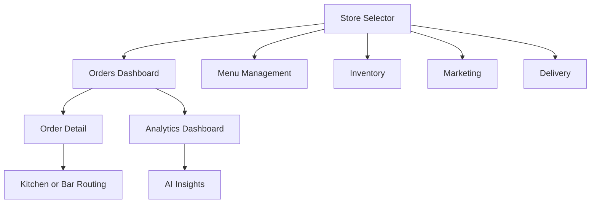

# Admin App Detailed Design

## Overview

The admin app is the restaurant operator surface of PizzaOS. It must convey operational readiness, insight generation,
and multi-store scalability while remaining entirely simulated.

## Detailed Requirements

- Desktop-first layout and information hierarchy
- Immediate access into a logged-in operator state
- Real dataset switching across stores
- Simulated live order board
- Kitchen and bar separation
- Menu, product, pricing, inventory, marketing, analytics, AI, and delivery coverage
- Placeholder UI for future external delivery integration
- Explicit reset or reseed path

## Architecture Overview

### Feature Map

```text
app/
  page.tsx
  orders/
  menu/
  inventory/
  marketing/
  analytics/
  delivery/

src/features/
  store-switch/
  orders-board/
  order-detail/
  production-routing/
  menu-management/
  pricing/
  inventory/
  marketing/
  analytics/
  ai-insights/
  delivery/
```

### State Model

- store context controls which seeded dataset is active
- local simulation drives incoming orders, status changes, and dashboard deltas
- operator actions mutate only local app state
- analytics and AI cards update off simulated order events inside admin

### Mermaid: Admin Operational Flow



## Components And Interfaces

### Main Components

- `AdminShell`
- `StoreSwitcher`
- `OrderBoard`
- `OrderColumn`
- `OrderDetailPanel`
- `KitchenBarSplitView`
- `MenuEditor`
- `InventoryTable`
- `DynamicPricingToggleCard`
- `CouponComposer`
- `AnalyticsOverview`
- `HeatmapCard`
- `AiInsightList`
- `DeliveryDispatchPanel`
- `IntegrationPlaceholderCard`

### Interfaces

- `AdminSeed`
- `StoreDashboardSnapshot`
- `OrderQueueViewModel`
- `InventoryAlert`
- `MarketingAutomationRule`

## Data Models

### `AdminSeed`

- `stores`
- `activeStoreId`
- `orders`
- `inventory`
- `menus`
- `pricingFlags`
- `marketingRules`
- `analyticsSnapshots`
- `aiInsights`
- `deliveryAssignments`

### `StoreDashboardSnapshot`

- `storeId`
- `salesToday`
- `topClickedProducts`
- `heatmapCells`
- `activeAlerts`

### `MarketingAutomationRule`

- `id`
- `name`
- `trigger`
- `offer`
- `status`

## Error Handling

- empty board states are explicit and useful
- missing store dataset falls back to default store seed
- integration placeholders must never look broken
- edit forms use inline validation and safe cancel flows

## Testing Strategy

- Unit tests for store switching, queue derivation, analytics deltas, and automation rule helpers
- Component tests for dashboard widgets, order board behavior, inventory states, and menu forms
- E2E tests for:
  - switching stores
  - simulating order board updates
  - toggling pricing
  - seeing analytics and AI updates

## Appendices

### Technology Choices

- Shared operational primitives from `packages/ui`
- Admin theme from `packages/brand`
- app-local dense layout composition and dashboard templates

### Research Findings

- Real dataset switching is necessary for multi-store credibility.
- Local-only simulations can still deliver a strong sense of operational motion if deterministic and visually clear.

### Alternative Approaches

- Pure placeholder admin pages were rejected because they would weaken the operational value story.
