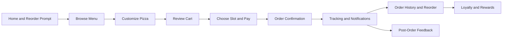

# Client App Detailed Design

## Overview

The client app is the customer-facing ordering experience for PizzaOS. It must feel fast, clear, and premium on mobile,
while still supporting rich customization and post-order engagement.

## Detailed Requirements

- Mobile-first interaction model
- Immediate logged-in demo access
- Reorder-first entry points
- Rich pizza customization with price transparency
- Visible availability, sold-out treatment, and slot clarity
- Cart, checkout, mock payment, tip, and order confirmation
- Order tracking, notifications, loyalty, coupons, subscription, and feedback
- Explicit reset or reseed path

## Architecture Overview

### Feature Map

```text
app/
  page.tsx
  menu/
  product/[id]/
  cart/
  checkout/
  orders/
  rewards/

src/features/
  home/
  menu/
  customization/
  cart/
  checkout/
  orders/
  loyalty/
  tracking/
  feedback/
```

### State Model

- app state is local to the client app
- a store slice owns cart, order history, loyalty, coupons, and notifications
- seed data hydrates the initial experience
- order simulation advances through deterministic timers

### Mermaid: Client Journey



## Components And Interfaces

### Main Components

- `ClientHomeScreen`
- `ReorderPrompt`
- `MenuGrid`
- `ProductSheet` or `ProductDetailPage`
- `CustomizationStepper`
- `PriceSummaryBar`
- `CartDrawer` or `CartPage`
- `CheckoutSlotPicker`
- `OrderStatusTimeline`
- `TrackingMapCard`
- `RewardsOverview`
- `FeedbackPrompt`

### Interfaces

- `ClientSeed`
- `CartItemViewModel`
- `SlotAvailability`
- `NotificationViewModel`
- `TrackingSnapshot`

## Data Models

### `ClientSeed`

- `featuredProducts`
- `menuSections`
- `suggestedPairings`
- `lastOrder`
- `loyaltyState`
- `availableCoupons`

### `SlotAvailability`

- `slotId`
- `label`
- `status`
- `etaMinutes`

### `TrackingSnapshot`

- `orderId`
- `status`
- `riderLabel`
- `mapPosition`
- `lastUpdatedAt`

## Error Handling

- unavailable products remain visible but disabled or visually marked
- empty cart prevents checkout with clear inline messaging
- invalid coupon state is explained inline
- tracking card stays hidden or neutral until dispatch state is reached
- corrupted demo state falls back to reseed

## Testing Strategy

- Unit tests for pricing derivation, coupon logic, slot selection, and order simulation
- Component tests for menu cards, customization flow, cart, checkout, and tracking states
- E2E tests for:
  - reorder flow
  - standard order flow
  - customization-heavy flow
  - feedback prompt after delivery

## Appendices

### Technology Choices

- Use the shared PizzaOS client theme from `packages/brand`
- Use shared primitives from `packages/ui`
- Keep mobile layout composition and page rhythm inside the app

### Research Findings

- The client UX must support both speed and reassurance.
- Visibility of slot, price, and availability is more important than showing every possible configuration at once.

### Alternative Approaches

- A desktop-first client layout was rejected because it conflicts with the core usage context.
