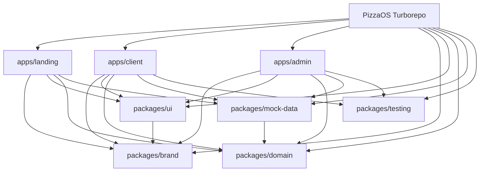
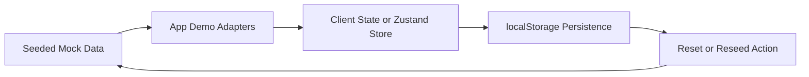
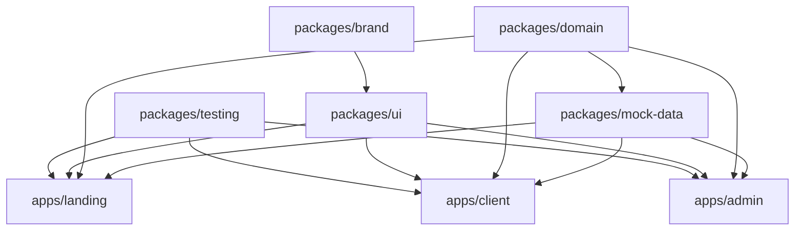

# PizzaOS Shared Detailed Design

## Overview

PizzaOS is a frontend-only Proof of Concept presented as a product ecosystem composed of three separate apps:

- `landing`
- `client`
- `admin`

The POC must look commercially credible, feel nearly complete in navigation, and remain technically lightweight by
relying on mocked data, local persistence, and deterministic simulations.

The design objective is not to prove backend complexity. It is to prove product shape, UX quality, and future scaling
potential.

## Detailed Requirements

The following requirements are consolidated from the requirements clarification process:

- All three apps have equal demo priority.
- The apps are presented as one PizzaOS ecosystem but live on separate domains.
- The repository must be a Turborepo monorepo with three separate Next.js App Router apps.
- The design must be AI-friendly:
  - feature-first app structure
  - shared packages for reusable contracts
  - root README, app READMEs, package READMEs
- Visual impact is the dominant product goal.
- Nearly every feature from the original brief must appear in a navigable form.
- PizzaOS branding should feel defined and close to final.
- The POC should feel flexible for chains and single stores, but the demo scenario is centered on a single pizzeria.
- Language is Italian across UI and marketing copy.
- Device priorities:
  - landing: strongly responsive
  - client: mobile-first
  - admin: desktop-first
- Main demo narrative:
  - landing introduces the value proposition
  - client app shows ordering
  - admin app shows restaurant operations
  - admin analytics and AI updates are simulated locally
- Shared internal packages are required for brand, UI, domain, mock data, and testing support.
- Every app needs a curated initial state and explicit reset or reseed behavior.
- Landing CTAs must mix route-out behavior and in-page interactions.
- The testing baseline is Vitest, React Testing Library, and Playwright.
- The success criteria are:
  - impress stakeholders in demo
  - show perceived full operational coverage
- Brand system model:
  - landing: editorial premium food
  - client: warm tech premium
  - admin: bold operational SaaS
- Do not use Tailwind CSS.
- Use a hybrid component strategy.
- Admin multi-store switching must swap real datasets.
- Access should be immediate with assumed logged-in users.
- Optimize for happy path while keeping selected edge states visible.

## Architecture Overview

### Monorepo Layout

```text
apps/
  landing/
  client/
  admin/

packages/
  brand/
  ui/
  domain/
  mock-data/
  testing/
  eslint-config/
  typescript-config/
```

### Architectural Intent

- `apps/*` own routes, feature orchestration, and surface-specific composition.
- `packages/brand` owns the PizzaOS brand core and surface theme variants.
- `packages/ui` owns shared primitives and reusable composites.
- `packages/domain` owns shared types and business contracts.
- `packages/mock-data` owns seeded demo data and simulation helpers.
- `packages/testing` owns shared testing helpers and fixtures.

### Runtime Model

- Each app is independently runnable.
- Each app persists its own state into localStorage.
- Each app hydrates from seeded mock data on first load or reset.
- No app depends on another app at runtime.
- Cross-app narrative coherence is achieved through coordinated datasets, shared naming, and consistent visual language.

### Mermaid: System Architecture



### Mermaid: Demo Data Flow



## Components And Interfaces

### Shared Packages

#### `packages/brand`

Public responsibilities:

- token contracts
- semantic aliases
- three theme definitions
- typography scale
- motion and elevation primitives

Expected interfaces:

- `getThemeClass(surface)`
- `themeVars`
- token exports for spacing, radius, z-index, motion

#### `packages/ui`

Public responsibilities:

- accessible primitives
- shared layout elements
- status indicators
- cards, tabs, dialogs, sheets, forms, tables, charts scaffolds

Expected interfaces:

- typed React components
- theme-aware style recipes
- limited and documented public API per component family

#### `packages/domain`

Public responsibilities:

- type models
- enum-like status definitions
- derived view-model helpers

Expected interfaces:

- `Product`
- `Menu`
- `Order`
- `OrderStatus`
- `StoreProfile`
- `InventoryItem`
- `Coupon`
- `LoyaltyState`
- `AnalyticsSnapshot`
- `AiInsight`

#### `packages/mock-data`

Public responsibilities:

- app seed factories
- scenario fixtures
- multi-store admin datasets
- deterministic timers and state transition helpers

Expected interfaces:

- `createLandingSeed()`
- `createClientSeed()`
- `createAdminSeed(storeId)`
- `resetDemoState(appId)`
- `advanceOrderSimulation(state, now)`

#### `packages/testing`

Public responsibilities:

- render helpers
- mocked timers
- storage reset helpers
- shared Playwright fixtures or selectors

### App Interfaces

#### `landing`

- CTA routing config
- section composition config
- modal or form state

#### `client`

- product browsing and customization flows
- cart and checkout state
- order lifecycle simulation
- loyalty and marketing state

#### `admin`

- order board simulation
- store switch context
- analytics and AI insight panels
- menu, inventory, marketing, and delivery views

### Mermaid: Component Relationships



## Data Models

### Core Shared Entities

#### `StoreProfile`

- `id`
- `name`
- `city`
- `mode`
- `themeAccent`
- `inventoryProfileId`

#### `Product`

- `id`
- `name`
- `description`
- `category`
- `price`
- `isAvailable`
- `isServedRaw`
- `allergens`
- `pairingIds`
- `image`

#### `ProductCustomization`

- `doughId`
- `ingredientSelections`
- `variantId`
- `extraSelections`
- `notes`
- `finalPrice`

#### `Menu`

- `id`
- `name`
- `availabilityWindow`
- `sections`

#### `Order`

- `id`
- `storeId`
- `channel`
- `items`
- `slotId`
- `tipAmount`
- `couponCode`
- `status`
- `priority`
- `createdAt`
- `timeline`

#### `AnalyticsSnapshot`

- `storeId`
- `salesTotal`
- `topClickedProducts`
- `heatmapCells`
- `conversionSignals`

#### `AiInsight`

- `id`
- `storeId`
- `title`
- `description`
- `type`
- `priority`

### State Strategy

- Use local state or Zustand per app.
- Persist only app-owned slices into localStorage.
- Recompute lightweight derived values from seed plus local mutations where possible.
- Keep simulation clocks deterministic for testability.

## Error Handling

The POC is happy-path first, but error treatment still needs design discipline.

### Shared Error Categories

- missing or corrupt localStorage seed
- invalid route parameters
- missing mock record
- simulated form validation failures
- unsupported or empty state in a feature view

### Handling Strategy

- fall back to a safe reseed path when demo state is invalid
- show human-readable empty states
- use inline validation for forms
- avoid dead-end screens
- ensure every simulation failure can recover through reset or retry

## Testing Strategy

### Test Layers

- Unit tests for helpers, derivations, seed factories, and simulation logic
- Component tests for critical UI states and feature interactions
- Playwright smoke and scenario tests for the main demo flows

### Shared Testing Goals

- verify monorepo packages can be consumed by all apps
- verify reset and reseed behavior
- verify theme and layout primitives render predictably
- verify no feature step lands without tests for the introduced behavior

### Key End-To-End Scenarios

- landing CTA opens the intended demo path
- client order can be created from menu to confirmation
- admin store switch changes visible dataset
- admin order board and analytics simulation update locally

## Appendices

### Technology Choices

#### Next.js App Router

Pros:

- modern routing and layout model
- good fit for multi-app monorepo
- easy to compose demo-first pages and app shells

Cons:

- shared package configuration must be explicit
- server and client boundary mistakes can add friction if not documented

#### Turborepo

Pros:

- clear workspace orchestration
- good support for multiple apps and shared packages
- scalable base for future real product growth

Cons:

- adds workspace ceremony compared to a single app

#### vanilla-extract

Pros:

- typed theming
- zero-runtime CSS output
- good fit for shared brand contracts

Cons:

- adds authoring conventions the team must learn

#### Radix Primitives

Pros:

- accessible primitives
- flexible styling
- strong fit for a hybrid component system

Cons:

- more assembly work than a closed component library

### Research Findings Summary

- Turborepo is the correct base for a three-app monorepo.
- Shared packages should be explicit and small.
- Next.js `transpilePackages` should be used for local shared packages.
- A shared brand core with app-specific composition is more suitable than a rigid themed component library.
- The provided UX foundation strongly reinforces the client app focus on quick ordering, visibility, reassurance, and
repeat behavior.

### Alternative Approaches Considered

- Single Next.js app with route-separated surfaces
  - rejected because it weakens the separate-domain product story
- Tailwind-based design system
  - rejected because of the explicit project constraint
- One shared visual style with minimal app variation
  - rejected because it would undersell landing storytelling and admin operational clarity
