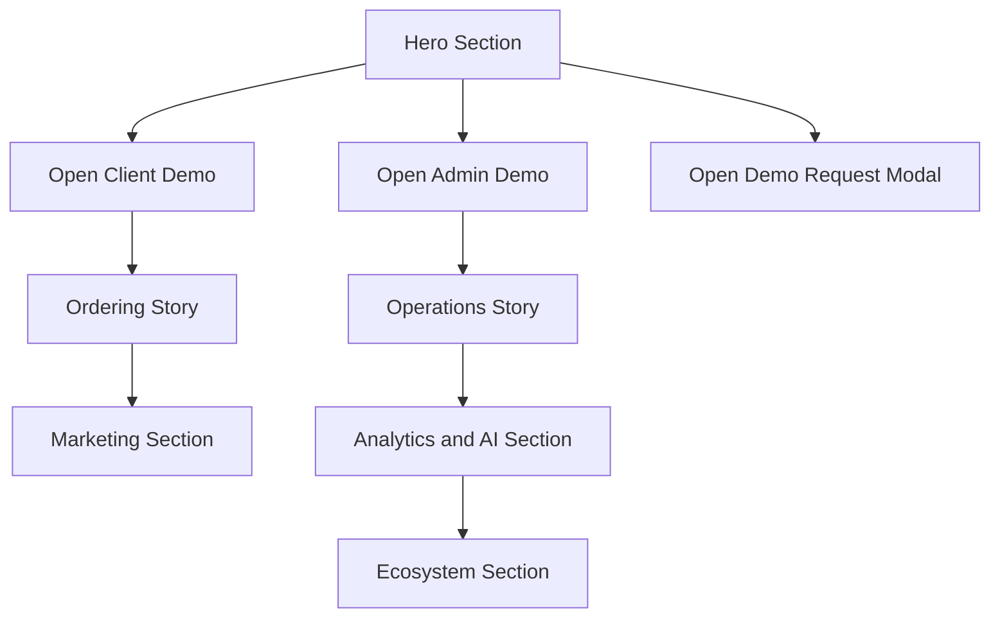

# Landing App Detailed Design

## Overview

The landing app is the product presentation surface for PizzaOS. Its job is to convert attention into belief:

- PizzaOS is a serious product
- PizzaOS covers the full restaurant journey
- PizzaOS is worth a live demo

The app uses the shared brand core but expresses it with an editorial premium food tone.

## Detailed Requirements

- Strong Italian-language value proposition above the fold
- Mixed CTA model:
  - route to client demo
  - route to admin demo
  - in-page modal or form interaction
- Coverage of all major product pillars:
  - advanced ordering
  - marketing automation
  - delivery and tracking
  - analytics and AI
  - restaurant operations
  - broader ecosystem
  - differentiation
- Responsive presentation with especially strong desktop storytelling
- Visually polished enough for investor or prospect demos

## Architecture Overview

### Route Strategy

- `/` for the full landing page
- optional anchored sections for storytelling navigation
- optional modal route state or client-side modal state for demo request

### Content Strategy

- editorial sections can be driven by a typed local content configuration
- CTA destinations are centrally configured to avoid hardcoded links across sections

### Mermaid: Landing Flow

## Components And Interfaces

### Main Components

- `LandingShell`
- `HeroSection`
- `FeatureNarrativeSection`
- `ComparisonOrDifferentiationSection`
- `DemoRequestModal`
- `SectionNav`
- `DemoCTAGroup`

### Interfaces

- `LandingSectionConfig`
- `LandingCtaConfig`
- `LandingMetricHighlight`

## Data Models

### `LandingSectionConfig`

- `id`
- `eyebrow`
- `title`
- `description`
- `featureBullets`
- `visualVariant`
- `cta`

### `LandingCtaConfig`

- `label`
- `actionType`
- `href`
- `modalId`
- `trackingName`

## Error Handling

- missing CTA target falls back to a safe disabled state with explanatory copy
- modal submission errors are simulated inline
- missing visual assets fall back to branded illustration blocks

## Testing Strategy

- Component tests for hero, CTA routing, modal behavior, and responsive section rendering
- Smoke E2E for:
  - page load
  - modal open and submit
  - CTA out to client
  - CTA out to admin

## Appendices

### Technology Choices

- Use shared `packages/brand` for tokens and theme
- Use shared `packages/ui` for primitives and CTA components
- Use app-local composition styles for editorial layouts

### Research Findings

- Landing must remain distinct in tone without diverging from the PizzaOS brand core.
- Strong desktop-first storytelling is compatible with a responsive implementation.

### Alternative Approaches

- One long generic SaaS page was rejected because it would undersell the food and hospitality angle.
