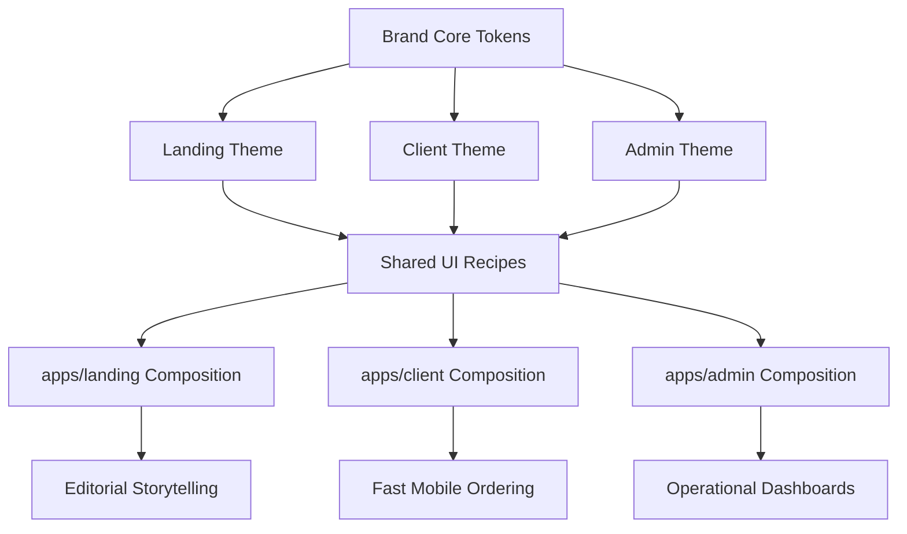

# Research: Frontend Platform Choices

## Scope

This note focuses only on the frontend choices needed to proceed with design:

- styling and component strategy without Tailwind
- a shared brand system across three distinct app expressions
- UX implications from the user-provided client UX foundations, adapted to a generic PizzaOS product

## Key Input From The Provided UX Foundation

The provided UX foundation document reinforces these customer-app constraints:

- the client app is mono-brand and should feel like a direct relationship with the pizzeria
- ordering must stay fast even when customization is rich
- availability, pricing, and delivery slots must always be visible
- recurring users should be recognized and pushed toward fast reorder
- tracking and post-order engagement are part of the experience, not afterthoughts
- the app should support both confident repeat buyers and less digital users who need reassurance

Adapted to PizzaOS, this means the customer app should feel:

- simple
- guided
- reliable
- relationship-driven over time

These constraints are directly compatible with your chosen priorities:

- mobile-first client app
- visually strong demo
- nearly everything navigable
- happy-path first, with selected edge states

## Source Findings

### Next.js natively supports CSS Modules and Sass

Official Next.js documentation supports:

- CSS Modules for component-scoped styling
- global CSS
- Sass support via `sass`

Implication for PizzaOS:

- no need to adopt Tailwind for speed
- app-level composition can use CSS Modules or SCSS Modules without fighting the framework

### vanilla-extract is a good fit for typed themes and shared styling contracts

Official vanilla-extract documentation supports:

- build-time CSS generation
- typed design tokens
- themes
- recipes and sprinkles for reusable style APIs

Implication for PizzaOS:

- shared brand tokens can live in a reusable package
- three surface variants can share a common token core without becoming visually identical

### Radix Primitives fit a hybrid approach better than Radix Themes

Radix Primitives are unstyled building blocks. Radix Themes documentation explicitly notes that Themes components are
relatively closed and not always easily overridden.

Inference:

- for PizzaOS, Radix Primitives are a better fit than Radix Themes
- you need stronger visual differentiation across landing, client, and admin than a relatively closed themed library

## Recommendation For PizzaOS

Use a hybrid frontend stack:

- `Radix Primitives` for accessibility and interaction behavior
- `vanilla-extract` in shared packages for tokens, themes, and reusable style recipes
- `SCSS Modules` or `CSS Modules` inside each app for page composition and surface-specific layouts

This combination best fits your constraints:

- no Tailwind
- shared brand system
- three different visual expressions
- AI-friendly package boundaries
- enough speed for a POC without locking design into a rigid component library

## Why This Hybrid Stack Is Strong

### Shared where it matters

Put stable visual contracts in shared packages:

- colors
- spacing
- radii
- elevations
- type scale
- motion primitives
- common component recipes

### Local where it should stay local

Keep high-variance composition inside each app:

- landing editorial sections
- client mobile layout patterns
- admin dense dashboard layouts

This avoids over-engineering the shared UI layer.

## Recommended Styling Allocation

### `packages/brand`

- core tokens
- semantic aliases
- three surface themes:
  - `landing`
  - `client`
  - `admin`

### `packages/ui`

- shared accessible primitives
- buttons, dialogs, tabs, sheets, selects, toasts, cards, pills, data indicators
- style recipes tied to the brand package

### app-local styles

- route-level composition
- editorial storytelling layouts in landing
- mobile interaction spacing in client
- dashboard density and panel layouts in admin

## UX Implications For The Client App

Derived from the provided UX foundation and adapted to PizzaOS:

- the home screen should explain the service implicitly, not through a forced tutorial
- repeat ordering must be visible immediately on app open
- pizza customization should be step-based and price-aware
- allergen and raw-versus-cooked ingredient information should be visible during selection
- delivery slot availability must be explicit and visual
- post-order tracking should become prominent only when relevant
- loyalty, rewards, and feedback prompts should feel like continuation of the order journey

## Brand System Recommendation

Use one PizzaOS brand core with three controlled surface expressions:

- `landing`: editorial premium food
- `client`: warm tech premium
- `admin`: bold operational SaaS

This should be implemented as theme variation, not as three unrelated design systems.

## Mermaid: Styling And Theme Layers

## Decision Output

The frontend platform recommendation is:

- Next.js App Router in each app
- no Tailwind
- Radix Primitives for behavior and accessibility
- vanilla-extract for shared brand and reusable styling contracts
- CSS Modules or SCSS Modules for app-local composition

## Sources

- Next.js, "CSS Modules": https://nextjs.org/docs/app/building-your-application/styling/css-modules
- Next.js, "Sass": https://nextjs.org/docs/app/building-your-application/styling/sass
- vanilla-extract, "Documentation": https://vanilla-extract.style/documentation/
- vanilla-extract, "Sprinkles": https://vanilla-extract.style/documentation/packages/sprinkles/
- Radix Primitives: https://www.radix-ui.com/primitives
- Radix Themes, "Styling": https://www.radix-ui.com/themes/docs/overview/styling
