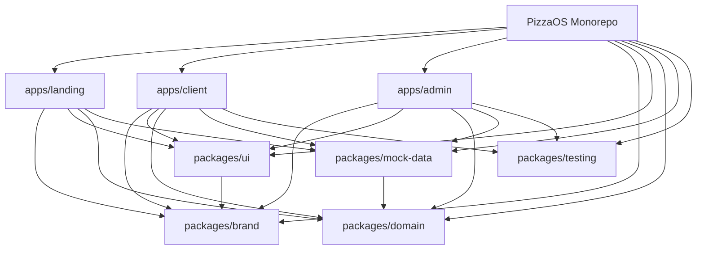

# Research: Monorepo Architecture

## Scope

This note focuses only on the monorepo decisions required to proceed with design:

- Turborepo structure for three separate Next.js apps
- shared internal packages
- app/package boundaries that remain AI-friendly

## Source Findings

### Turborepo works naturally with internal workspace packages

Official Turborepo guidance treats internal packages as first-class building blocks in a workspace, referenced through
workspace dependencies such as `workspace:*`.

Implication for PizzaOS:

- shared code should live in `packages/*`, not be copied between apps
- app/package dependency edges should be explicit in `package.json`

### Turborepo has a straightforward Next.js monorepo path

Official Turborepo guidance for Next.js shows the expected model:

- multiple Next.js apps inside `apps/*`
- internal packages consumed by each app
- root `turbo.json` defining shared tasks

### Next.js supports transpiling local monorepo packages

Next.js supports `transpilePackages` for local packages and external dependencies. This is especially relevant when apps
consume local TypeScript packages or shared styling packages.

Implication for PizzaOS:

- each app should explicitly list shared local packages in `transpilePackages`
- this is especially important if shared UI and styling are authored in TypeScript

### Turborepo supports package-specific task overrides

Turborepo package-level configuration can extend the root configuration when an app or package needs specialized tasks.

Implication for PizzaOS:

- keep a simple root task graph first
- only add per-package `turbo.json` where behavior genuinely differs

## Recommendation For PizzaOS

Use a single Turborepo with three Next.js apps and a small set of shared internal packages.

### Recommended Top-Level Structure

```text
apps/
  landing/
  client/
  admin/

packages/
  brand/
  ui/
  domain/
  mock-data/
  testing/
  eslint-config/
  typescript-config/
```

### Why This Structure Fits The Requirements

- It matches the requirement for separate domains and separate apps.
- It keeps cross-app sharing intentional instead of accidental.
- It is AI-friendly because ownership is obvious:
  - apps own surface-specific UX and routes
  - packages own reusable contracts and primitives
- It supports your README requirement cleanly:
  - root README
  - one README per app
  - one README per package

### Recommended Responsibility Split

#### `apps/landing`

- product marketing surface
- editorial storytelling
- CTA routing to demo surfaces
- stronger app-specific visual composition

#### `apps/client`

- customer ordering experience
- mobile-first routes and flows
- reorder, customization, checkout, tracking, loyalty, feedback

#### `apps/admin`

- restaurant operations and analytics surface
- desktop-first information density
- multi-store switching with different mock datasets

#### `packages/brand`

- shared token contracts
- theme definitions
- surface variants for landing, client, admin
- typography, color, spacing, motion, radius, elevation primitives

#### `packages/ui`

- shared UI primitives
- wrappers around accessible headless components
- PizzaOS-flavored reusable controls

#### `packages/domain`

- shared domain types and view-model contracts
- menu, product, order, inventory, coupon, loyalty, analytics, rider-tracking models

#### `packages/mock-data`

- seed datasets
- per-app scenario fixtures
- multi-store admin datasets
- reset/reseed helpers

#### `packages/testing`

- shared testing utilities
- render helpers
- mock time helpers
- Playwright fixtures or shared selectors if needed

## App-Internal Structure Recommendation

Inside each app, use feature-first organization below the route layer.

```text
apps/client/
  app/
  src/
    features/
      menu/
      cart/
      checkout/
      orders/
      loyalty/
      tracking/
    shared/
      hooks/
      stores/
      lib/
```

Reasoning:

- the App Router owns route entry points
- `src/features/*` owns product behavior
- AI agents can reason about feature boundaries without scanning the whole app

## Recommended Dependency Rules

- apps can depend on packages
- packages should not depend on apps
- `ui` may depend on `brand`
- `mock-data` may depend on `domain`
- `ui` should avoid depending on `mock-data`
- app-specific features should consume mock data through adapters, not deep imports from other apps

## Recommended Documentation Baseline

- root README: workspace map, commands, package graph, demo flow
- app README: routes, feature map, state model, reset behavior
- package README: purpose, public API, ownership expectations

## Mermaid: Repository Relationship



## Decision Output

The architecture recommendation is:

- Turborepo monorepo
- three separate Next.js apps in `apps/*`
- a compact set of shared internal packages in `packages/*`
- feature-first organization inside each app
- explicit use of `transpilePackages` for shared local packages

## Sources

- Turborepo, "Next.js": https://turborepo.com/repo/docs/guides/frameworks/nextjs
- Turborepo, "Internal Packages": https://turborepo.com/repo/docs/core-concepts/internal-packages
- Turborepo, "Creating an Internal Package": https://turborepo.com/repo/docs/crafting-your-repository/creating-an-internal-package
- Turborepo, "Package Configurations": https://turborepo.com/repo/docs/reference/package-configurations
- Next.js, "`transpilePackages`": https://nextjs.org/docs/app/api-reference/config/next-config-js/transpilePackages
